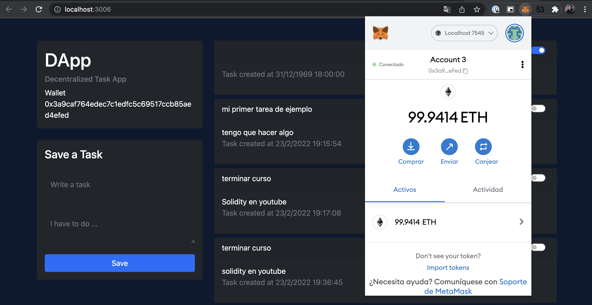

 <p align="center">
 <br><br>
  <a href="https://docs.metamask.io/guide/">
    
  </a>
  <a href="https://ethereum.org/en/">
    
  </a>
  <a href="https://docs.soliditylang.org/en/v0.8.12/">
    
  </a>
  <a href="https://javascript.info/">
    
  </a>
</p>

## myfirstcontract

Solidity &amp; Javascript App - Ethereum DAPP
based on the tutorial [Youtube](https://www.youtube.com/watch?v=FAMWIoKvfRs)

 </img>

## Requirements

1. Use [ganache](https://trufflesuite.com/ganache/) to run local tests in the Ethereum blockchain.
2. Install [truffle](https://trufflesuite.com/) to develop smart contracts
```
npm install -g truffle
```
3. Install [metamask](https://metamask.io/) as a wallet
4. Create a localhost account on metamask

## Steps to run project
1. You need to have the metamask plugin installed on the navegator
2. Init ganache
4. In the terminal in the folder path
```
sudo truffle migrate
```
5. Run the project
```
npm run dev
```